# Lab Report 4 
### Name: Tianhao Chen(A16875083)

---

## Links to markdown-parser repositories
[markdown-parser](https://github.com/Cthloveross/markdown-parse)<br>
[Reviewed-markdown-parser](https://github.com/Cthloveross/reviewedmarkdownparse)

---


## Expeted results (using VScode preview function)
#### snippet1
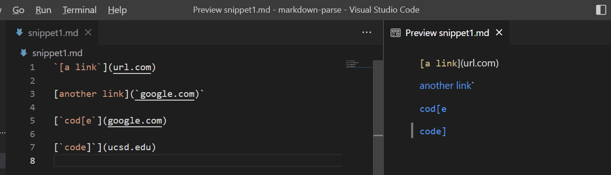
#### snippet2
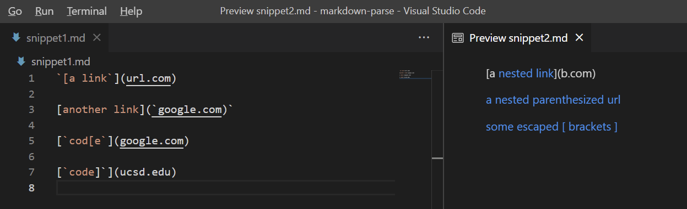
#### snippet3
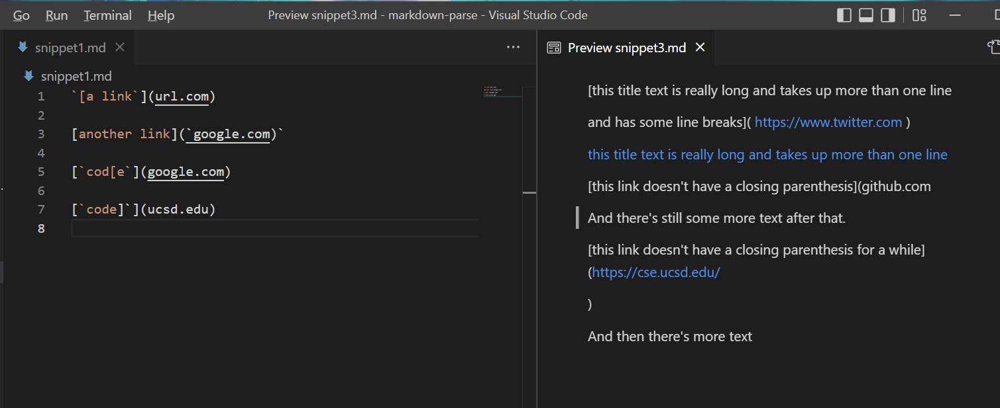

## Here is the code for tests in MarkdownParseTest.java
#### snippet1
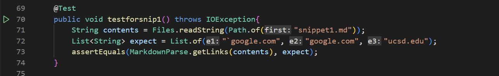
#### snippet2
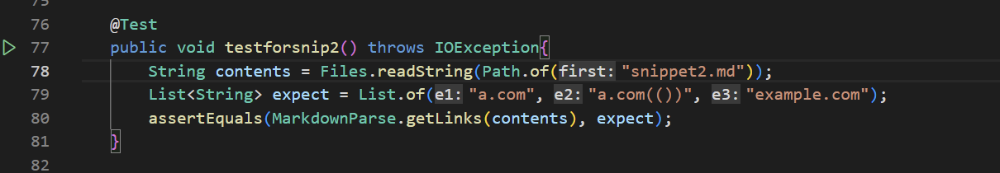
#### snippet3
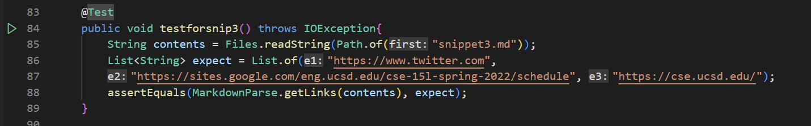

## Here is the output of running tests.
#### here is my implementation by using junit
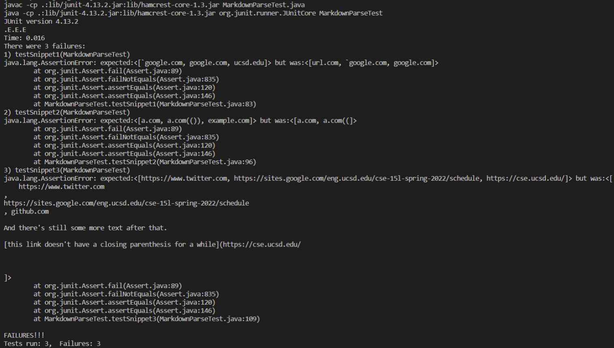

#### here is reviewed implementation by using junit
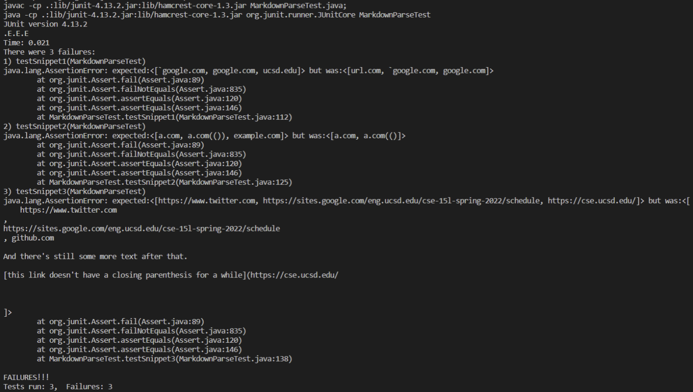

## My implementation for failures
#### Failed Snippet1
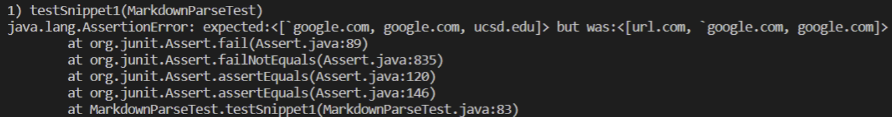
#### Failed Snippet2
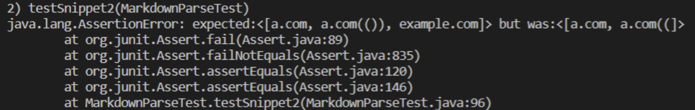
#### Failed Snippet3
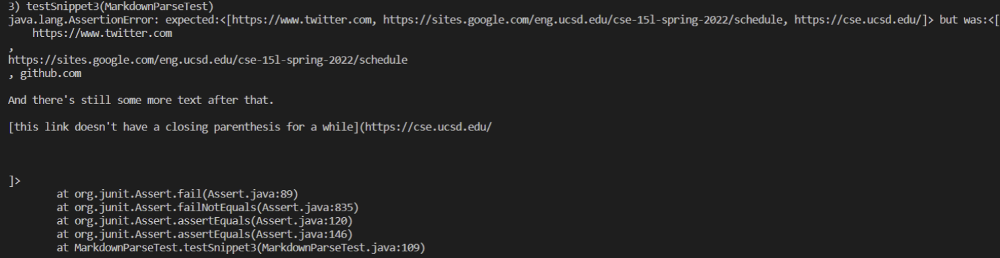

## Reviewed implementation for failures
#### Failed Snippet1
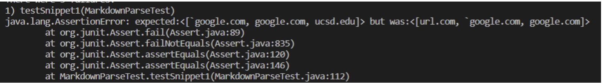
#### Failed Snippet2
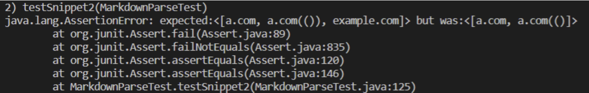
#### Failed Snippet3
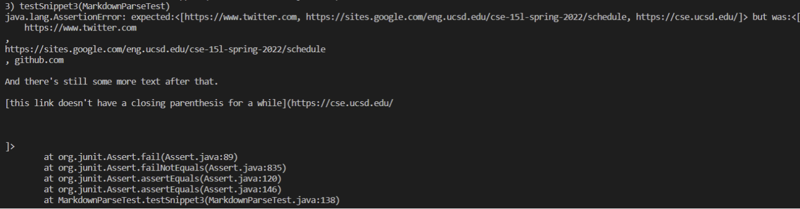

---

## Questions:

Answer for question 1: From my perspective, I think the problem for snippet1 failure can be fixed in 10 lines because it is just a small mistake. Now it considers ```url.com``` as a valid link, but ```ucsd.edu``` as on invalid one. For ```url.com```,I just need to add one ```if statement``` to check if there is an openbracket is at the beginning. For ```ucsd.edu```,I just need to add one ```if statement``` to check if a backtick is the previous character.

Answer for question 2: From my perspective, I think the problem for snippet1 failure maynot be fixed in 10 lines because we have to consider too many situations. The problem we have now is that index is out of bounds. For, example, I can check if there exists additional brackets, but the problem has too many combinations, so 10 line might not be enough for me.

Answer for question 3: Similar to Snippet2, I don't think that a small change within 10 lines can fix the problem I have now, and the problem is also index is out of bound. To fix the problem, I have to check if there is a missing ```openbracket```, or ```closeparen```, these changes may take more than 10 lines.
